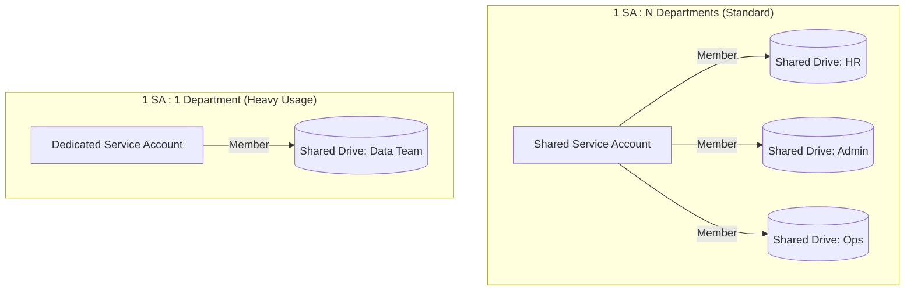

# Use Cases & Product Roadmap: Google Drive MCP Server

This document separates the current operating model from future product opportunities. Roadmap items are proposals only; unless explicitly marked otherwise, they are **not implemented, not exposed as MCP capabilities, and must not be represented as available features**.

Authentication terminology and deployment flows are documented in the [Least Privilege Key Authentication Architecture](architecture/authentication.md).

## Scope and Extension Policy

`Unsupported` means that a capability is outside this project's current design, verification, documentation, and security guarantee. Users may fork the project or build an integration outside this roadmap, but that custom behavior is not an upstream capability or an upstream security guarantee. Any capability added to the upstream project must receive its own design review, threat model, tests, and ADR where it changes the security boundary.

## 🎯 V1 Operating Model: Single-Tenant Shared Drive

V1 deliberately supports **one Service Account : one Department : one Shared Drive per MCP instance**. The multi-department shared Service Account model is flagged as unsupported until routing, allowlisting, and cross-tenant boundary policy are designed and reviewed.

This reduces the application security problem to a single-tenant, two-layer Boundary Check. The MCP instance must receive one mandatory Shared Drive ID. An optional Root Folder ID can narrow access to a project subtree within that Shared Drive. Authentication relies on Least Privilege Key principles; boundary configuration is separate from authentication configuration.

See the detailed [V1 Boundary Model](architecture/boundary-model.md) for diagrams, evaluation flow, and allow/deny examples.

### V1 Boundary Rules

- Search, direct file access, and writes must remain inside the configured Shared Drive.
- When a Root Folder is configured, those operations must also remain within its descendant hierarchy.
- The Shared Drive is the hard boundary; the Root Folder is a narrower project boundary, not a replacement for the Shared Drive check.
- Google Drive permissions are necessary but are not the application's only boundary.
- Shortcuts may resolve one hop to Files only. Folder shortcuts are unsupported.
- Shortcut Targets outside the configured Shared Drive, outside the configured Root Folder when one exists, or Targets that cannot be verified, are rejected.
- Rejected Shortcuts are omitted from listings and their `targetId` is not exposed.
- External URL-gated read-only access is out of scope for V1.

The following multi-tenant model is retained as a future option only. It is not the V1 recommendation and must not be deployed as the V1 boundary model without a new ADR.



### Future Model (1 SA : N Departments — Unsupported in V1)

- **Use Case:** Standard departments with low-to-medium API traffic (e.g., HR, Admin, Operations).
- **Pros:** Meets company requirements for simplicity and ease of management. Reduces SA sprawl.
- **Cons:** Larger blast radius (SA has access across departments). Shared API quotas.

### V1 Model (1 SA : 1 Department)

- **Use Case:** Departments with high file transaction volumes (e.g., Data, Media) or those handling highly confidential data (e.g., Legal, Executive).
- **Pros:** **Quota Isolation** (prevents heavy users from exhausting API limits) and **Security** (strict boundary isolation).

### V1 Unsupported Capabilities

- One MCP instance spanning multiple Shared Drives.
- One Service Account serving multiple departments.
- Agent-selected boundary changes.
- Recursive Shortcut resolution.
- Shortcut-to-Folder traversal.
- External URL-gated reads.

## 🗺️ Product Roadmap

The roadmap is intentionally staged around trust, enterprise control, and differentiated workflows. Each item requires its own technical design, threat model, acceptance criteria, and stakeholder validation before implementation.

### Status Legend

| Status | Meaning |
| --- | --- |
| **Baseline** | Existing project capability or operating constraint |
| **Implemented V1** | Accepted V1 design implemented and covered by the current verification suite |
| **Design only** | Accepted design documented separately; implementation is pending |
| **Candidate** | Potential future feature; not implemented |
| **Research** | Requires technical, operational, or compliance validation before commitment |
| **Deferred** | Deliberately excluded from the first product scope |

### Phase 0 — Baseline and V1 Security Foundation

| Initiative | Status | Customer value |
| --- | --- | --- |
| Least Privilege Key / ADC / Impersonation | **Baseline** | Enforces minimal IAM roles, supports server deployments without complex WIF |
| Single-tenant Shared Drive deployment | **Implemented V1** | Limits each MCP instance to one Department boundary |
| Strict Boundary & Shortcut Defense | **Implemented V1** | Prevents indirect access outside the configured Shared Drive |
| AI Circuit Breaker / quota protection | **Design only** | Reduces denial-of-wallet and runaway-agent risk |

### Phase 1 — Advanced Governance and Context

| Initiative | Status | Proposed capability | Key dependency / risk |
| --- | --- | --- | --- |
| AI Access Audit Dashboard | **Candidate** | Searchable audit trail of files read or changed by AI agents | Requires durable event schema, identity attribution, retention, and dashboard infrastructure |
| Time-Travel Context | **Candidate** | Ask what changed in a document or retrieve a historical revision | Drive Revisions limitations, diff quality, storage cost, and token cost |
| Cross-Platform Context Sync | **Candidate** | Persist Drive context across Claude, Cursor, Gemini, and other MCP clients | Requires a portable context model, sync service or local store, and privacy controls |
| Local Model Connector (Ollama) | **Candidate** | Keep retrieved Drive content in a local-model workflow | Local runtime support, document formatting, data lifecycle, and support burden |
| Continuous Markdown Exporter | **Candidate** | Keep Google Docs content available to Obsidian and local knowledge bases | Webhook reliability, formatting fidelity, comments, images, and conflict handling |

### Phase 2 — Scoped Policy Control

| Initiative | Status | Proposed capability | Key dependency / risk |
| --- | --- | --- | --- |
| Multi-Agent Permission Routing | **Deferred** | Apply different read/write/folder policies to Research, Writer, and QA agents | Requires agent identity, policy enforcement, auditability, and a formal authorization model; incompatible with the simple V1 boundary until redesigned |
| Multi-department Shared Service Account model | **Deferred** | Reduce Service Account sprawl for organizations with many departments | Larger blast radius, cross-tenant routing, quota contention, and complex offboarding |

### Phase 3 — Research Bets and Validation Required

| Initiative | Status | Possible value | Why it is not committed |
| --- | --- | --- | --- |
| Local RAG & Semantic Search | **Research** | Natural-language retrieval over large Drive repositories | Crowded space; indexing, freshness, ranking, and operating cost need validation |
| Autonomous Workflow Agents | **Research** | Trigger multi-step actions from Drive events | High safety and reliability risk; requires eventing, approvals, retries, and idempotency |
| Data Anonymization / PII Redaction | **Research** | Reduce sensitive-data exposure before model calls | Significant accuracy, legal liability, and compliance obligations |
| Auto-Summary Map / Repository Index | **Research** | Lower token cost when navigating large document collections | Summary freshness, quality evaluation, storage cost, and possible Google-native competition |
| Auto-OCR & Rich Media | **Research** | Make PDFs and images usable in AI workflows | OCR quality, file-type coverage, external API cost, and large-payload handling |

---

## 🏷️ Naming Conventions

To ensure easy management and tracking of Service Accounts, the following naming convention is strictly recommended:

- **Shared SAs (1:N, future only):** `mcp-drive-shared-<group/region>@<project>.iam.gserviceaccount.com`
  - *Example:* `mcp-drive-shared-backoffice@...`
- **Dedicated SAs (1:1):** `mcp-drive-dedicated-<department>@<project>.iam.gserviceaccount.com`
  - *Example:* `mcp-drive-dedicated-data@...`

---

## 🔐 Storage & Access Control Strategy

To ensure files remain the property of the organization rather than individual users or Service Accounts:

1. **Storage Mechanism:** Use **Shared Drives (Team Drives)** exclusively. Avoid using "My Drive".
2. **Access Provisioning:**
   - Create a Shared Drive for each department.
   - Add the designated Service Account's email address as a Member (e.g., `Content Manager` or `Viewer` depending on the MCP server's required capabilities) to the respective Shared Drive.

---

## 📊 Monitoring & Trigger Points (Future Scaling)

If the future shared-SA model is reconsidered, monitor API usage (via Google Cloud Monitoring / Workspace Audit Logs) before introducing it. V1 already provides quota and boundary isolation per Department:

- **Future trigger for spin-off (1:N -> 1:1):** If a Shared SA consistently hits >80% of its Drive API quota, or if a single department is responsible for >50% of the traffic.
- **Action:** Create a new Dedicated SA, add it to the heavy-usage department's Shared Drive, remove the Shared SA from that Drive, and update the MCP client configurations.

---

## ♻️ Lifecycle Management & Offboarding

- **For Dedicated SAs (1:1):** When a department is spun off or shut down, simply disable or delete the Service Account in Google Cloud IAM.
- **For Shared SAs (1:N, future only):** Remove the Service Account from the specific department's Shared Drive members list.

---

## 🛑 Security & Compliance (Strict Zero Key Policy)

Per **ADR-0001**, this MCP Server strictly enforces a **Zero Key Policy**.

Even though multiple Service Accounts may be used in this architecture, **you must never download or use Service Account JSON Keys.**

All setups must rely on **Application Default Credentials (ADC)** via Service Account Impersonation. The machine running the MCP server must execute:

```bash
gcloud auth application-default login --impersonate-service-account="<SERVICE_ACCOUNT_EMAIL>"
```

### ⚠️ Troubleshooting & Known Limitations

- **"Service Accounts do not have storage quota":** If you encounter this error during a file upload, it means you are trying to upload to a Personal Drive (My Drive). SAs have 0 bytes of quota on personal drives. **Fix:** Ensure the target folder is located within a Google Workspace Shared Drive.
- **401 Unauthorized / 403 Forbidden:** The SA token might have expired, or the SA lacks permissions. **Fix:** Re-run the `gcloud auth application-default login` command above, and verify the SA is a member of the target Shared Drive.
