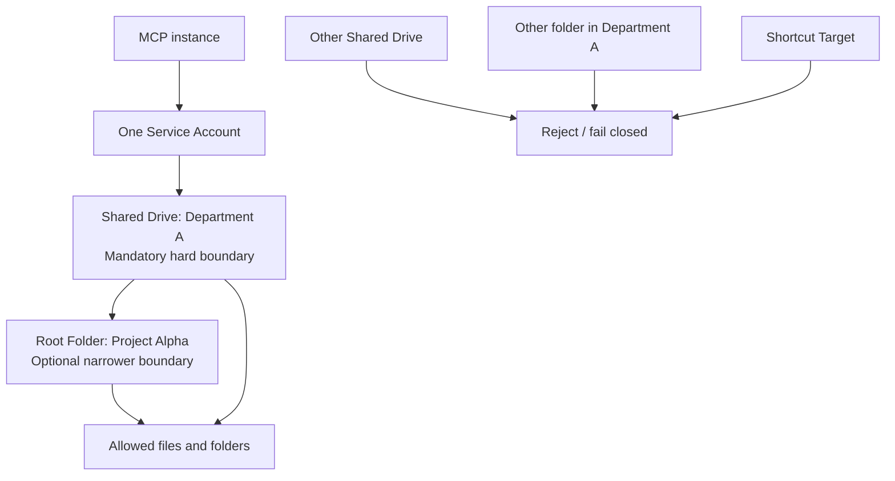
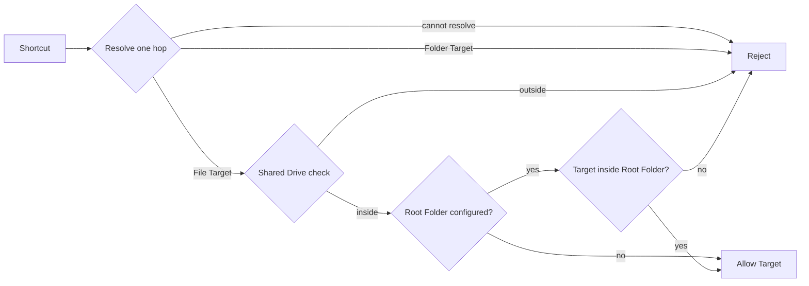

# V1 Boundary Model

This document explains the implemented V1 application boundary for the Google Drive MCP server. It is a reference for users, operators, reviewers, and contributors.

## Boundary in one sentence

One MCP instance serves one Department through one Service Account. The configured Shared Drive is the mandatory hard boundary; an optional Root Folder narrows access to a project subtree within that Shared Drive.

## Two-layer model



The layers have different responsibilities:

| Layer | Meaning | Rule |
| --- | --- | --- |
| Shared Drive | Department or tenant isolation | Always required; nothing outside it is allowed |
| Root Folder | Project-level narrowing | Optional; when configured, only descendants are allowed |
| Google Drive permission | Provider-level authorization | Necessary for access, but not sufficient as the application boundary |

If no Root Folder is configured, the effective application scope is the entire configured Shared Drive. A target must never be accepted solely because the Service Account has Google Drive permission to it.

## Example structure

```text
MCP instance: department-a-mcp
└── Service Account: mcp-drive-department-a@project.iam.gserviceaccount.com
    └── Shared Drive: Department A                 [mandatory boundary]
        ├── Project Alpha                          [optional Root Folder]
        │   ├── Specs
        │   │   └── requirements.docx              [allowed when Root Folder is Alpha]
        │   └── Reports
        │       └── weekly-report.pdf              [allowed when Root Folder is Alpha]
        ├── Project Beta                            [blocked when Root Folder is Alpha]
        └── Department-wide Handbook                [blocked when Root Folder is Alpha]

Other Shared Drive: Department B                   [always blocked]
└── Confidential HR data                            [never reachable by this instance]
```

## Boundary evaluation

Every search result, direct `fileId`, parent folder, and Shortcut Target follows the same policy:

```text
request
  │
  ├─ Is the target resolvable and verifiable?
  │      └─ no → reject
  │
  ├─ Is the target in the configured Shared Drive?
  │      └─ no → reject
  │
  ├─ Is a Root Folder configured?
  │      ├─ no → allow Shared Drive scope
  │      └─ yes → verify target is a descendant of Root Folder
  │                    ├─ no → reject
  │                    └─ yes → continue
  │
  └─ perform the requested operation
```

Boundary uncertainty is never treated as authorization. If the target, parent hierarchy, Shared Drive, or Root Folder membership cannot be verified, the operation fails closed and does not read or write the target.

## Shortcut policy

V1 supports a Shortcut only when all of these conditions hold:

1. The Shortcut is encountered through an in-bound operation.
2. It resolves exactly one hop.
3. Its Target is a File, not a Folder.
4. The Target belongs to the configured Shared Drive.
5. If a Root Folder is configured, the Target is within that Root Folder hierarchy.



Rejected Shortcuts are omitted from list/search results and their `targetId` is not exposed. The server does not recursively follow Shortcuts and does not use a Shortcut as a reason to bypass either boundary.

## Allow and deny examples

| Request | Shared Drive | Root Folder | Result |
| --- | --- | --- | --- |
| Read a file under the configured Root Folder | same | descendant | Allow |
| Read a file elsewhere in the configured Shared Drive | same | outside | Reject when Root Folder is configured; allow otherwise |
| Read a file in another Shared Drive | different | irrelevant | Reject |
| Read a direct `fileId` with no in-bound search first | verified same | valid or not configured | Apply both checks; never bypass |
| Follow a Shortcut to a file in the same Shared Drive | same | valid | Allow after one-hop resolution |
| Follow a Shortcut to another Shared Drive | different | irrelevant | Reject |
| Follow a Shortcut to a Folder | any | any | Reject in V1 |
| Target metadata or parent chain cannot be loaded | unknown | unknown | Reject / fail closed |
| Read an external Google Drive URL | outside internal boundary | outside internal boundary | Deferred; not a V1 capability |

## Configuration model

The boundary configuration is separate from keyless authentication:

```text
GOOGLE_DRIVE_SHARED_DRIVE_ID=<mandatory Department Shared Drive ID>
GOOGLE_DRIVE_ROOT_FOLDER_ID=<optional project Root Folder ID>
GOOGLE_DRIVE_MODE=<optional mode: "readonly" to disable write tools>
```

The Service Account identity is still resolved through ADC / Service Account Impersonation. These boundary values do not contain credentials and do not replace Google Drive permissions.

## V1 scope limits

The following are outside the V1 boundary model:

- One MCP instance spanning multiple Shared Drives.
- One Service Account serving multiple departments.
- Agent-selected boundary changes.
- Recursive Shortcut resolution.
- Shortcut-to-Folder traversal.
- External URL-gated reads.

`Unsupported` means outside the project's current design, verification, documentation, and security guarantee. Users may implement custom behavior in a fork or separate integration, but that behavior is not an upstream capability or an upstream security guarantee.

## Related decisions

- [ADR-0002: Root Folder Isolation](../adr/0002-root-folder-isolation.md) — superseded for V1 by the two-layer model.
- [ADR-0005: External Shared File Access](../adr/0005-external-shared-file-access.md) — deferred future capability.
- [ADR-0009: Single-Tenant Two-Layer Boundary and Shortcut Defense](../adr/0009-single-tenant-boundary-and-shortcut-defense.md) — normative V1 decision.
